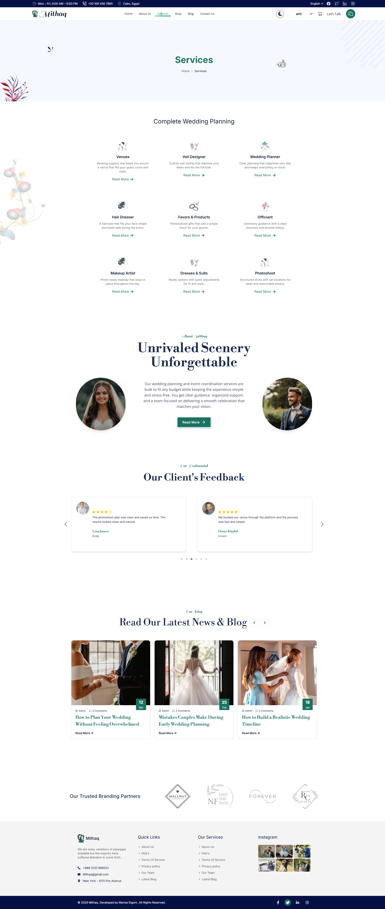
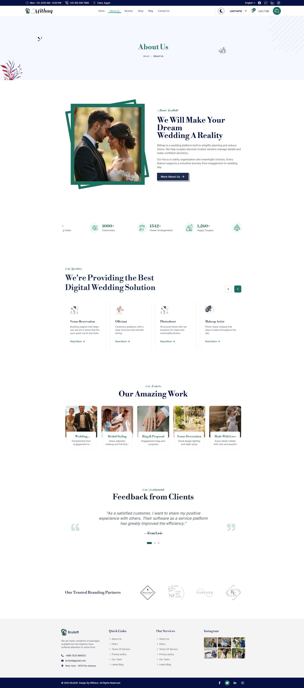
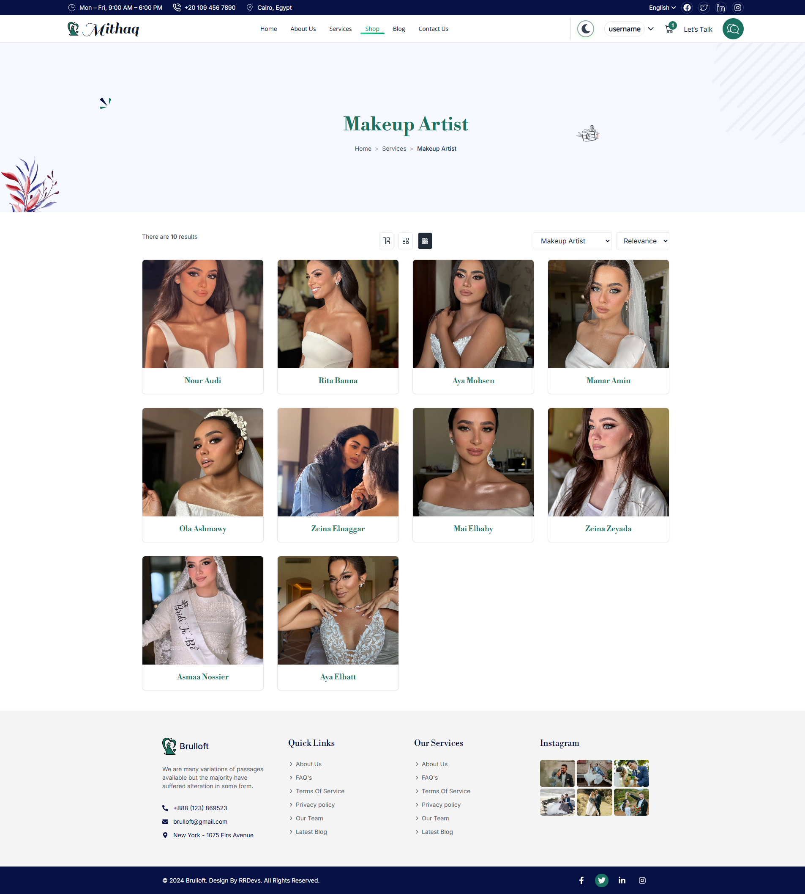
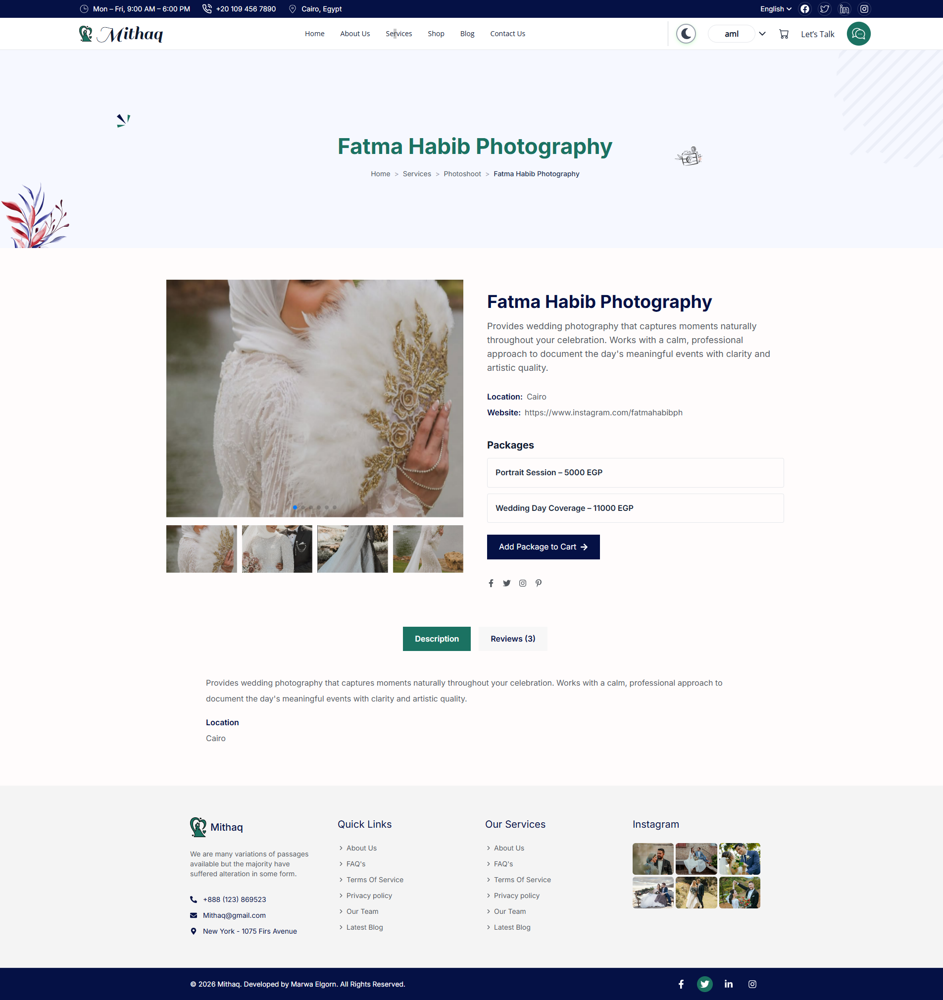
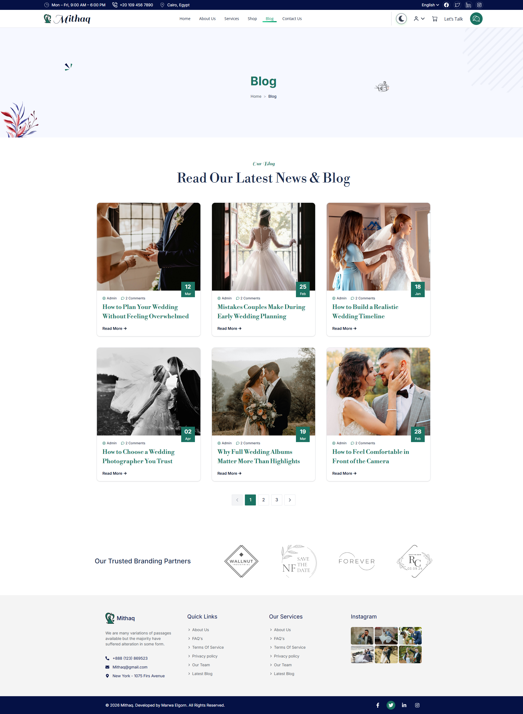
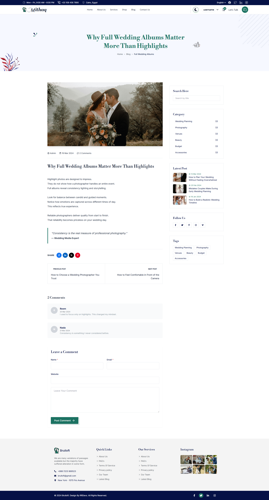
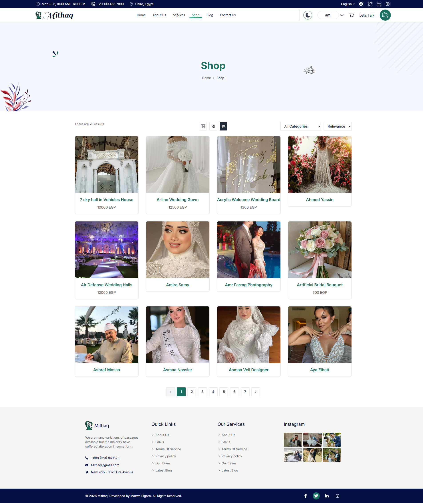
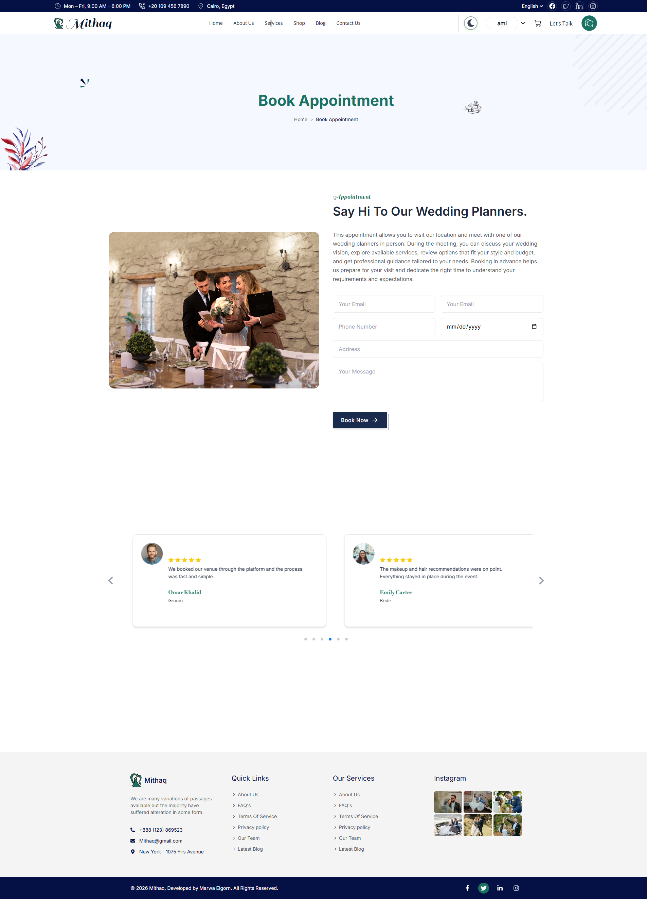
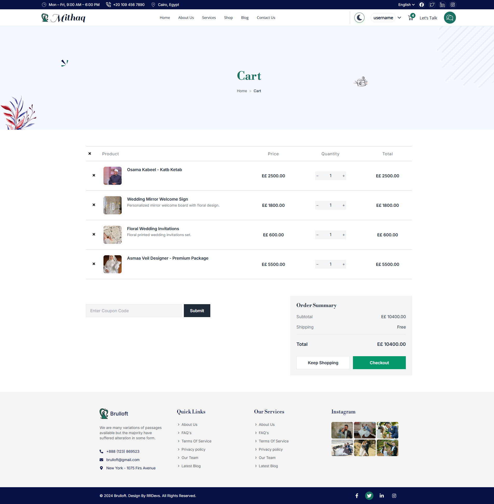
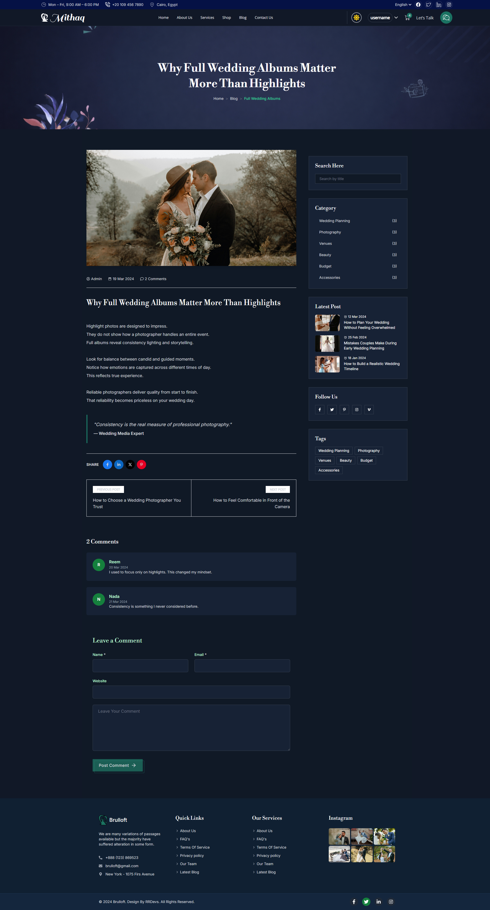

# Mithaq – Wedding Planning Platform  
Graduation Project | Recruiter Focused Documentation

Mithaq is a full featured wedding planning platform built to solve real problems in the Egyptian wedding market.  
The project demonstrates the ability to design build and deliver a production style frontend application with real backend integration using Supabase.

This repository represents a complete end to end product not a UI demo.

---

## Project Context

Wedding planning in Egypt is fragmented and stressful.

Couples depend on  
- Facebook groups  
- Manual price comparison  
- Phone calls and messages  
- Unverified recommendations  

This leads to wasted time financial risk and mental pressure.

Mithaq was built to centralize the entire wedding planning journey into one structured trusted digital platform.

---

## Graduation Project Goals

This project was developed to demonstrate

- Real world problem solving  
- Scalable frontend architecture  
- Backend integration using Supabase  
- Authentication and protected user flows  
- UX driven feature decisions  
- Production ready code organization  

---

## Product Scope

The platform covers the full wedding planning lifecycle.

Users can  
- Explore wedding services vendors and products  
- View detailed vendor and service profiles  
- Compare pricing packages and availability  
- Select dates and book appointments  
- Add services and products to a personal cart  
- Authenticate before sensitive actions  
- Learn through educational blog content  

---

## Core Features

### Browsing and Discovery
- Organized categories
- Unified shop experience
- Clear navigation and filtering

### Vendor and Service Details
- Image galleries
- Pricing and packages
- Availability dates
- Structured information display

### Booking System
- Date selection logic
- Availability validation
- Appointment booking
- Prevention of invalid actions

### Shopping Cart
- User specific cart
- Persistent cart data
- Add remove and update items
- Authentication gated access

### Authentication
- Supabase authentication
- Email and password login
- Secure session handling
- Protected routes

### Content and Blog
- Educational blog section
- Budget planning guidance
- Scam avoidance content
- Decision support articles

### UI and UX
- Fully responsive design
- Light and dark mode
- Smooth page transitions
- Animations with Framer Motion
- Loading indicators
- Toast notifications

---

## Technical Stack

### Frontend
- React 19
- React Router DOM v7
- Tailwind CSS
- Framer Motion
- Swiper

### Backend
- Supabase
- PostgreSQL
- Row Level Security

### Tooling
- Vite
- ESLint
- PostCSS

---

## Architecture Highlights

- Component based architecture
- Clear separation of concerns
- Reusable UI components
- Services layer for Supabase logic
- Scalable folder structure
- Clean routing strategy

---

## What This Project Demonstrates to Recruiters

- Ability to build a real product from idea to delivery
- Strong understanding of React architecture
- Experience with Supabase authentication and database
- Handling real business logic and edge cases
- Clean readable and maintainable code
- UX focused decision making
- Readiness for production level frontend roles

---

## Screenshots

### Home


### Services


### About


### Service Vendors Page


### Vendor Details


### Blog


### Blog Details


### Shop


### Book Appointment


### Cart


### Dark Mode


---

## Scripts

```bash
npm run dev
npm run build
npm run preview
